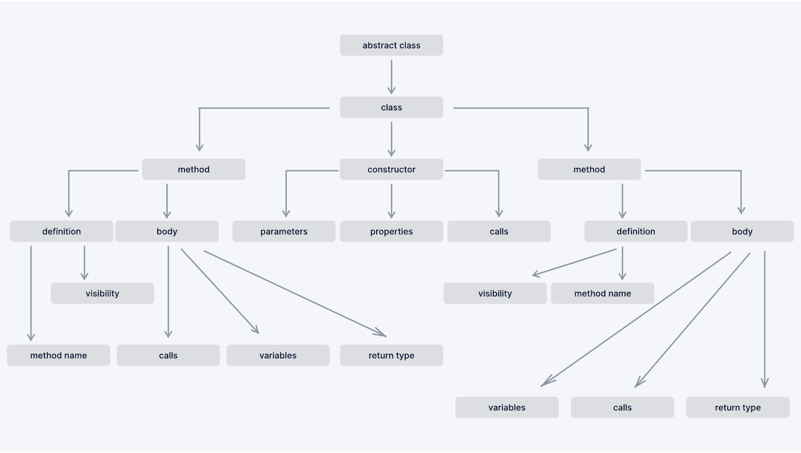
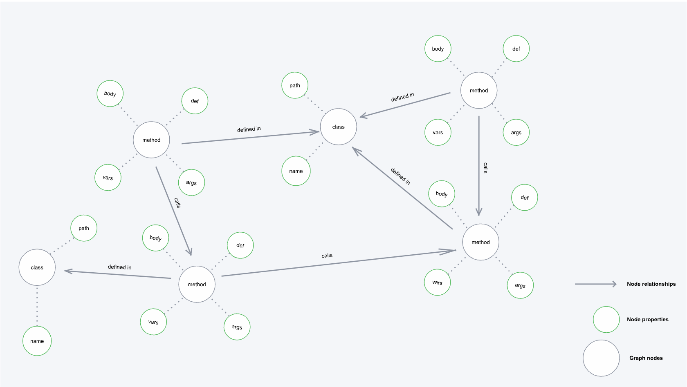
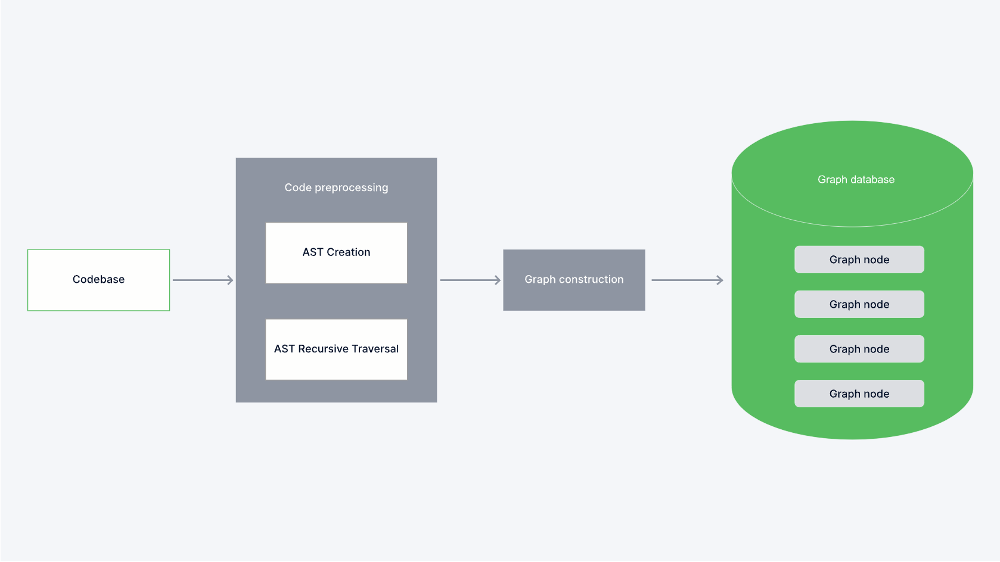

# Elevating Code Quality Through LLM Integration: Adyen's Venture into Augmented Unit Test Generation

At Adyen, we find ourselves at a fascinating crossroads of technology, captivated by the immense potential of Large Language Models (LLMs).
What sparked our exploration was a question that reflects curiosity and a strategic vision:

*How can we use LLMs, traditionally known for generating text, for a more structured task like code generation and, more specifically, for augmenting the process of creating unit tests?*

<!-- more -->

## **Innovating beyond current technology trends**

The question above represents more than just pursuing new technology; it's about a more profound, meaningful shift in how we approach productivity and developer experience.

By integrating LLMs into the task of writing unit tests – often a downplayed aspect of software development – our goal is twofold. Not only do we aim to make our development processes more efficient, but we also want to free up our teams to engage in the more complex and rewarding parts of their work.

A pivotal realization in our journey was that, to maintain the high standards of our codebase at Adyen, the augmented unit test generation with LLMs needed to be more than just efficient. We needed to do more than automate; we needed to innovate by augmenting our approach to unit testing.

It's about consistency and maintaining the same high-quality standard across all tests. We knew we could leverage the power of LLMs to minimize the variability of manual processes. 

We envisioned a precise solution that is context-aware and logically sound. This system will function as a tool and a partner in assuring quality and excellence in our software development.

## **Navigating the LLM landscape**

### Understanding the limitations of current applications

LLMs today show capability in straightforward programming tasks like crafting or modifying functions without external dependencies; for instance, tools like the widely adopted Github Copilot excel at enhancing developer efficiency beyond just generating boilerplate code. However, complexities arise in more advanced scenarios, including integrating or modifying code within large, pre-existing code frameworks, a challenge that AI and human developers commonly encounter.

To effectively undertake this task, a tool should be able to:

* Spot sections of the code that are relevant when writing unit tests.

* Comprehensively analyze and understand how identified segments interact with and fit into the overall architecture and flow of the codebase.

* Implement the necessary unit tests that complement and verify the functionality of the existing code.

This article will show how to spot and provide the relevant code snippets to the LLM. To optimize their performance, it's essential to guide LLMs in comprehending the entire codebase architecture.

### The challenge of code context and LLMs

The conventional RAG (Retrieval Augmented Generation) architecture adeptly handles text generation tasks by integrating information retrieval from a knowledge base with the generative capabilities of LLMs.

This approach is exemplified in another application within Adyen, as detailed in our article on Driving Operational Efficiency using LLMs. This system has shown commendable success in generating coherent and contextually relevant text by effectively leveraging vector embeddings. Vector embeddings serve as the core of conventional RAG systems, enabling them to interpret and process a vast array of information in a meaningful and applicable manner.

In real-world coding environments, we navigate far beyond isolated functions; our code is a network of interconnected elements, each integral to the system's collective functionality.Consider a class method as a component in a sophisticated machine. To effectively develop a unit test, one must understand the method's role – its dependencies and how it interacts with other system parts. 

Just as repairing one part of the machine requires knowledge of how it fits into the entire mechanism, creating a unit test demands a comprehensive understanding of the method within the broader system’s operations. This holistic perspective is vital, yet it poses a substantial challenge for LLMs. While they excel in understanding and generating text, they face difficulties comprehending code's interrelated nature, especially in large and complex systems.

### Fine-tuning resource constraints and challenges in conventional RAG systems

Integrating Large Language Models (LLMs) into today's applications demands a deep understanding of the technology and its specific application needs. Fine-tuning stands out as a critical practice in LLM integration. It involves training pre-trained, broad-scope LLMs on particular datasets to refine their comprehension and performance in specialized contexts. The advantages of fine-tuning are twofold: it aligns the model more closely with the unique language and nuances of the target domain, and it boosts the accuracy of context-aware responses. However, challenges arise due to the resource-intensive nature of fine-tuning and its inability to keep up with the rapid evolution common in software development environments, where codebases frequently update daily.

An essential understanding in our journey is the recognition that every challenge presented to the LLMs is different and thus requires a specialized approach.

In some cases, RAG pipelines are ideal for their ability to help update the LLMs' knowledge base and use the summarization/generation ability of the model to point in the right direction. Fine-tuning offers more significant benefits in other cases, especially those requiring more exact or nuanced content generation.

Through our testing, we have uncovered that in the domain of code generation, the combination of RAG and fine-tuning is best able to comprehend the complexity of a big codebase. In contrast to text generation, which relies on a broader range of contexts and language, code generation needs to be precise, context-sensitive, and logic-driven.

### The shortcomings of tokenization and vector embeddings in code generation

Tokenization is the backbone of all Natural Language Processing tasks. In the scope of the conventional framework of RAG systems, tokenization plays an important role. This process involves decomposing text into smaller, manageable units as tokens, which are the basis for vector embeddings.

Using vector embeddings within the context of the RAG framework empowers applications integrated with LLMs to effectively spot and retrieve contextually relevant information from the information retrieval layer. This capability is adjusted to the specific user queries, facilitating a targeted and appropriate response from the LLMs.

Vector embeddings have shown proficiency in text generation, yet they encounter notable challenges when adapted to the sophisticated coding domain. The core issue is that while adept at capturing specific linguistic patterns, vector embedding is not sufficiently nuanced to discern the detailed contextual and logical complexities inherent in code. Consequently, the conversion of natural language queries into vector forms, compared with vectorized code segments, is inadequate. This method falls short because it overlooks the complex, context-specific subtleties crucial in accurately identifying and fetching precise code snippets. The nuanced demands of understanding code's context, functionality, and potential interactions with other code elements are aspects that simple vector embeddings struggle to address effectively. One of the reasons why this is the case is that in most text generation cases, the syntactic nuances are often apparent in the rest of the document. 

This isn't necessarily the case for code. The actual implementation is often done using an abstract method; thus, it's necessary to adequately capture and feed these relevant code segments to the LLM, allowing them to understand the 'invisible' logic in the code. From our experience, sending the correct code snippets allows the LLM to truly understand the code and assist the engineer in generating unit tests.

In the domain of code generation, the semantics of code are context-dependent. The same line or snippet of code might assume different functionalities or intentions based on its placement within the codebase, the programming paradigm employed, or its interactions with other code segments. For example, a function call in one part of the program could have a different purpose in another, influenced by variables' states or program execution context. Vector embeddings, built to understand semantic essence based on word occurrence, struggle with such nuanced, context-driven meanings in code. Their fixed vector representations for code snippets fail to capture the dynamic and multifaceted nature of programming constructs, making them less effective in interpreting the subtle variations in meaning arising from complex code interactions.

Another complexity arises in maintaining state and dependencies within programming. Managing the state of variables, functions, and objects and understanding code dependencies are foundational to coherent and functional code generation. Vector embeddings, however, are limited to capturing surface-level textual similarities and semantic relationships. They can't map and maintain state changes and dependency structures integral to programming. This limitation is particularly evident in situations where the functionality of a code segment heavily depends on the program's state at a given moment, a scenario not explicitly captured in the semantic meaning of the code itself.

Thus, understanding the deeper meaning embedded within the code is crucial in the context of programming, a requirement beyond the surface-level semantic approaches offered by vector embeddings. The complexities of imports, hierarchies, sequences, and their interdependencies in a codebase are pivotal aspects that conventional embeddings do not capture. This inadequacy highlights the necessity for an approach that can delve deeper into the architectural essence of code, moving beyond mere lexical analysis to a more profound comprehension of programming logic and structure.

## **Adyen's Pioneering Approach: A Code-Context-Aware Solution**

As we navigated the complexities of adapting LLMs for code generation, it became clear that the route to success lay in customizing our approach to our unique challenge.

### AST (Abstract Syntax Tree) Parsing and Knowledge Graph

We realized the game-changing solution in our code generation initiative at Adyen by implementing Abstract Syntax Tree (AST) parsing and constructing Knowledge Graphs (KGs).

The AST offers a detailed structural representation of code, transcending the limitations of linear text representations.

Each node in the AST corresponds to specific constructs in the source code. By breaking down code into its constituent elements and organizing them hierarchically, the AST reflects the logical and syntactic architecture of programming languages with more granularity. The tree structure allows for a clear overview of the scope of variables, the sequence of function calls and the nesting of conditional statements. These are necessary for understanding the behavior and the structure of the program.

The AST's capability extends beyond mere syntactic representation. By abstracting from the literal text and representing code as a structured entity, AST allows for identifying hidden patterns and structures in the code that are not readily apparent in the raw source code. This is particularly vital for code analysis and code generation tasks where understanding the underlying logic and functional intent is as crucial as syntactic correctness. This concept applies across various programming languages to analyze the structure of the code, which is not achievable with text-based representations like vector embeddings.

Building upon our approach of using ASTs for in-depth code analysis, we knew it was noteworthy to explore pioneering methods in the field, such as those presented in the research paper [Open Vocabulary Learning on Source Code with a Graph–Structured Cache](https://arxiv.org/abs/1810.08305).
This study introduces an innovative technique of augmenting ASTs with extra labelled edges, providing deeper semantic insights such as data- and control-flow interactions between variables. Complementing ASTs and integrating Knowledge Graphs advanced our code analysis framework significantly. KGs are structured representations of the codebase, where entities (variables, functions, and classes) and their interrelations are depicted as nodes and edges, respectively. Constructing a KG for a codebase involves parsing the code to identify these entities and their interrelations, illuminating dependencies and inheritance hierarchies.

This enhancement transformed the traditional AST into a directed multigraph, offering a more comprehensive understanding of the code by representing various components interacting within the broader programming environment. This resulted in elevating the LLM's ability to generate unit tests accurately.

The combination of ASTs and KGs offered a holistic view of the codebase. While ASTs tackle syntactic aspects, once constructed, KGs can significantly complement ASTs by adding a layer of semantic understanding, which is crucial for interpreting complex interactions within the code. In our tests on object-oriented programming, this technique was used to map out the class and object relationships. This allows for a more in-depth contextual understanding.

Storing the processed code in a structured way, in a graph database, leads to a leap in our information retrieval capabilities. Unlike semantic similarity search methods, which rely heavily on vector embeddings and often miss intricate semantic connections of code, subtleties of programming languages and their contextual nuances, a graph database captures the interconnected nature of code elements. This setup allows for sophisticated queries that consider structural and semantic relationships, providing insights into functionality and dependencies crucial for accurate code generation and analysis.

## **Envisioning the Future: Advancing Adyen’s development with secure, scalable innovations**

At Adyen, our technological approach is constantly evolving. The next step is leveraging our progress with AST parsing and Knowledge Graphs to create an internal tool for our main source code. This initiative builds on our successes with these technologies in our open-source products. The goal is to refine our internal development processes, making them more efficient and effective.

The primary aim of this internal tool is twofold: to significantly boost the productivity of our developers and to elevate the reliability of our platform. We plan to automate and optimize various aspects of the software development lifecycle by integrating this sophisticated tool into our main source code. This integration will enable our developers to focus on creative and innovative tasks by alleviating the burden of routine and repetitive coding challenges. The anticipated increase in productivity is not just about speed; it's about enhancing the quality and efficiency of our work, allowing us to deliver more robust and reliable software solutions to our clients.

Looking further into the future, we envision combining these cutting-edge techniques with fine-tuning a self-hosted Large Language Model (LLM). This strategic integration aims to harness the full potential of LLMs, explicitly tailored to Adyen's unique development environment and needs. By fine-tuning a self-hosted LLM, we expect to achieve higher accuracy and efficiency in automated code generation and analysis. It will streamline our development processes and open new avenues for innovation and problem-solving within the company.

## **Conclusion**

In concluding our exploration into augmented unit test generation, we've discovered that integrating LLMs with knowledge graphs offers a tangible advancement in how we approach software testing. This realization streamlines the test generation process and brings a new level of depth and accuracy. By harnessing these technologies, we've managed to enhance the capabilities of our developers at Adyen, providing them with tools that understand and adapt to the complexities of our vast codebases.

More importantly, this development goes beyond just benefiting our developers. It serves our broader organizational ecosystem, addressing the needs and challenges faced by various teams.

The journey into leveraging LLMs underscores our commitment not just to adopt cutting-edge technologies but to do so in a way that directly addresses the multifaceted challenges of our stakeholders. It's a step towards enhancing how we develop software, grounded in the reality of our day-to-day work and the diverse needs of those we serve within Adyen.

*This article was originally published on the [Adyen Tech Blog](https://www.adyen.com/knowledge-hub/elevating-code-quality-through-llm-integration) and also on [Medium](https://medium.com/adyen/elevating-code-quality-through-llm-integration-adyens-venture-into-augmented-unit-test-generation-1727be6c146f).*